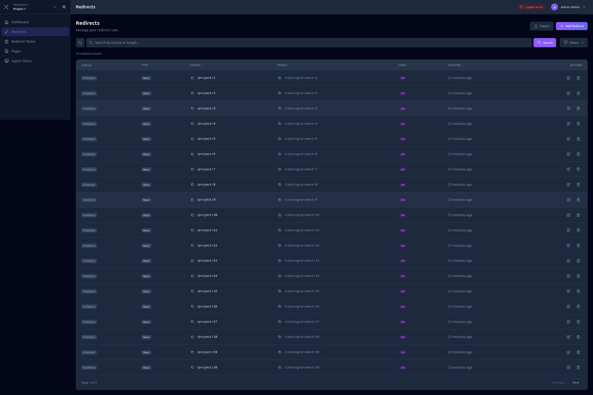
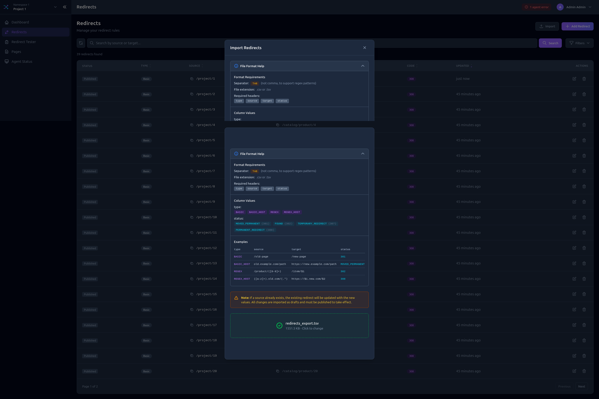
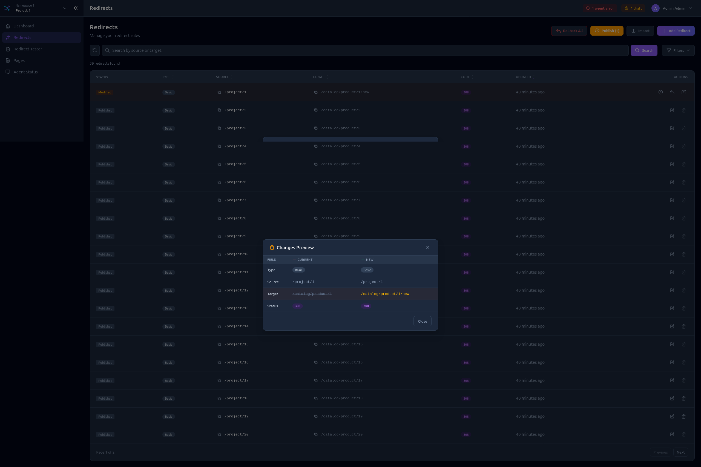

# Project Management

The project management interface allows you to manage redirects, pages, and monitor agents for a specific project.

Access it by selecting a namespace and project from the project switcher, or via URL: `/:namespace/:project/`

## Navigation

The sidebar provides access to:

- **Dashboard** - Project overview and statistics
- **Redirects** - Manage HTTP redirections
- **Redirect Tester** - Test redirect rules
- **Pages** - Manage static pages
- **Agent Status** - Monitor connected agents

## Dashboard

The project dashboard shows an overview of your project with key metrics:

- Total redirects (published/drafts)
- Total pages (published/drafts)
- Connected agents status
- Recent activity

## Redirects

### Redirects List

View all redirects with filtering and search capabilities.

Features:
- Search by source or target
- Filter by type (BASIC, BASIC_HOST, REGEX, REGEX_HOST)
- Filter by status code
- Sort by columns
- View draft changes

### Creating a Redirect

Click **Add Redirect** to open the form:

1. Select the redirect **Type**
2. Enter the **Source** path or pattern
3. Enter the **Target** URL
4. Select the **Status** code (301, 302, 307, 308)

### Bulk Import

Import multiple redirects from a TSV file:

1. Click **Import**
2. Select your `.tsv` or `.csv` file
3. Choose whether to **Overwrite** existing redirects
4. Review the import preview
5. Confirm import

## Redirect Tester

Test your redirect rules before publishing:

1. Enter a **Host** and **URI** to test
2. Click **Test**
3. See which redirect rule matches (if any)
4. View the resulting redirect target and status

## Pages

### Pages List

View all static pages in the project.

### Creating a Page

Click **Add Page** to open the form:

1. Select the page **Type** (BASIC, BASIC_HOST)
2. Enter the **Path**
3. Select the **Content Type** (TEXT_PLAIN, XML)
4. Enter the **Content**

## Agent Status

Monitor agents connected to this project:

- **Online** agents (synced recently)
- **Offline** agents (no sync within threshold)
- Agent name, type, and version
- Last sync timestamp

## Draft System

All changes are saved as drafts before publishing.

### Draft States

| Indicator | State | Description |
|-----------|-------|-------------|
| Green | Published | Live configuration, no pending changes |
| Yellow | Modified | Has unpublished changes |
| Blue | New | Created but not yet published |
| Red | Deleted | Marked for deletion |

### Publishing Changes

- **Publish All** - Apply all pending changes at once
- **Publish Individual** - Publish specific items
- **Discard** - Revert draft changes

### Viewing Changes

Click on a modified item to see the diff between published and draft versions.

