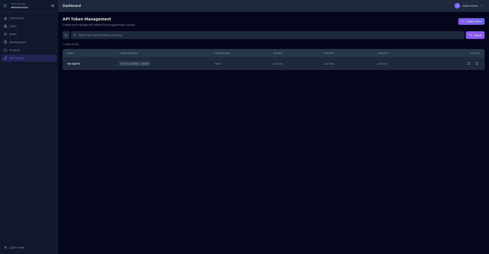

# Administration

The administration interface is for managing users, roles, namespaces, projects, and API tokens.

Access it via the **Admin** link in the header or directly at `/admin/`

## Navigation

The admin sidebar provides access to:

- **Dashboard** - Administration overview
- **Users** - Manage user accounts
- **Roles** - Configure roles and permissions
- **Namespaces** - Manage namespaces
- **Projects** - Manage projects
- **API Tokens** - Generate and manage API tokens

## Dashboard

The admin dashboard shows a global overview:

- Total users, roles, namespaces, projects
- System status
- Quick links to common actions

## Users

Manage user accounts for the Manager.

### Creating a User

1. Click **Add User**
2. Enter **Username** (unique identifier)
3. Enter **Password**
4. Optionally add **First name** and **Last name**
5. Assign **Roles** to the user

### User Authentication

Users can authenticate via:
- **Local credentials** - Username and password
- **OpenID Connect** - If configured (Google, Keycloak, etc.)

## Roles

Roles define what users can access and modify.

### Creating a Role

1. Click **Add Role**
2. Enter a **Name** for the role
3. Configure **Admin Permissions** (access to admin sections)
4. Configure **Resource Permissions** (access to projects and resources)

### Admin Permissions

Control access to administration sections:

| Section | Description |
|---------|-------------|
| `users` | Manage users |
| `roles` | Manage roles |
| `namespaces` | Manage namespaces |
| `projects` | Manage projects |
| `tokens` | Manage API tokens |

### Resource Permissions

Control access to project resources:

| Field | Description |
|-------|-------------|
| Namespace | `*` for all, or specific namespace code |
| Project | `*` for all, or specific project code |
| Resource | `*` for all, `redirect`, `page`, or `agent` |
| Action | `read`, `write`, or `*` for both |

## Namespaces

Namespaces are top-level groupings for projects (e.g., `production`, `staging`).

### Creating a Namespace

1. Click **Add Namespace**
2. Enter a **Code** (unique identifier, used in URLs)
3. Enter a **Name** (display name)

## Projects

Projects belong to namespaces and contain redirects, pages, and agents.

### Creating a Project

1. Click **Add Project**
2. Select the **Namespace**
3. Enter a **Code** (unique within namespace)
4. Enter a **Name** (display name)

## API Tokens

Generate API tokens for agents and automation.

### Creating a Token

1. Click **Add Token**
2. Enter a **Name** (descriptive identifier)
3. Set optional **Expiration date**
4. Configure **Permissions** (same as role permissions)
5. Click **Create**
6. **Copy the token immediately** - it's only shown once!

### Token Format

Tokens have the format: `flecto_xxxxxxxxxxxx...`

The token list shows a preview: `flecto_abcd...wxyz`

### Token Permissions

API tokens have their own permissions, independent of user roles. Configure:

- **Admin Permissions** - For tokens that need admin access
- **Resource Permissions** - For tokens that access specific projects

:::tip
For agents, create tokens with only the necessary resource permissions (read access to the specific namespace/project).
:::
